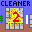

# Operation Cleaner 2

Restore of the game "Operation Cleaner 2" originally by Jan Nyman.

I downloaded it from archive.org and ported to Linux, mostly intact.

## License

It retains the original license, see [LICENSE](./LICENCE) for details.

## Requirements

I've used the "sdl12-compat" package on fedora (SDL 1.2 runtime compatibility library using SDL 2.0).

## Building

Run `make` in the current folder. This will build the target binaries.

## Running

Run `oc2` in the `oc2` folder to play the game.
